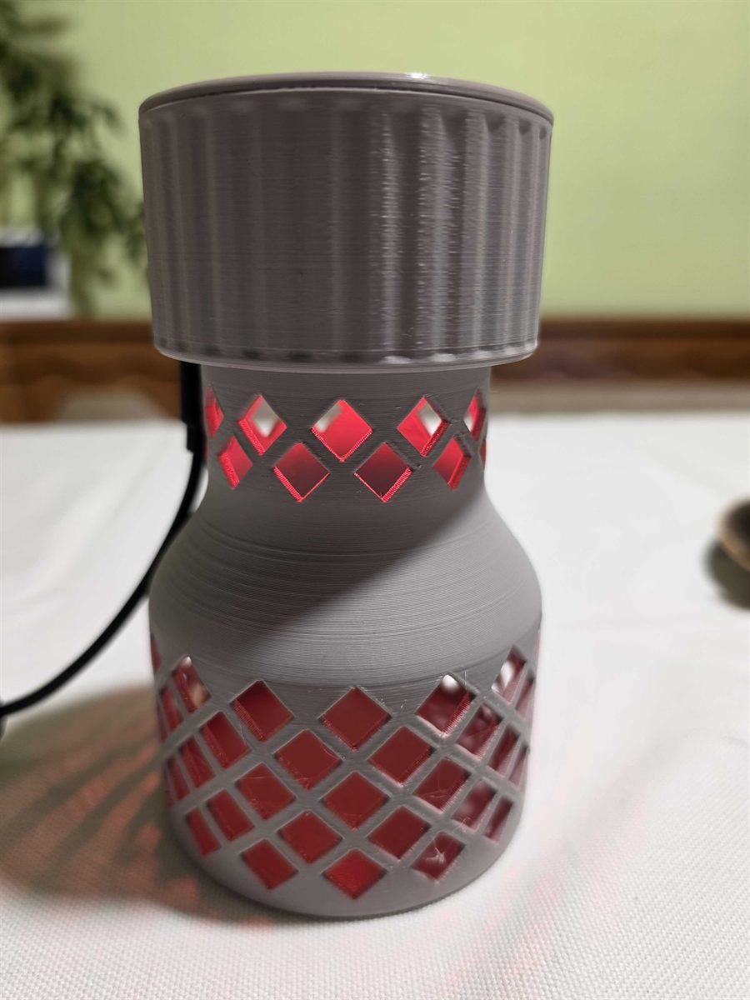
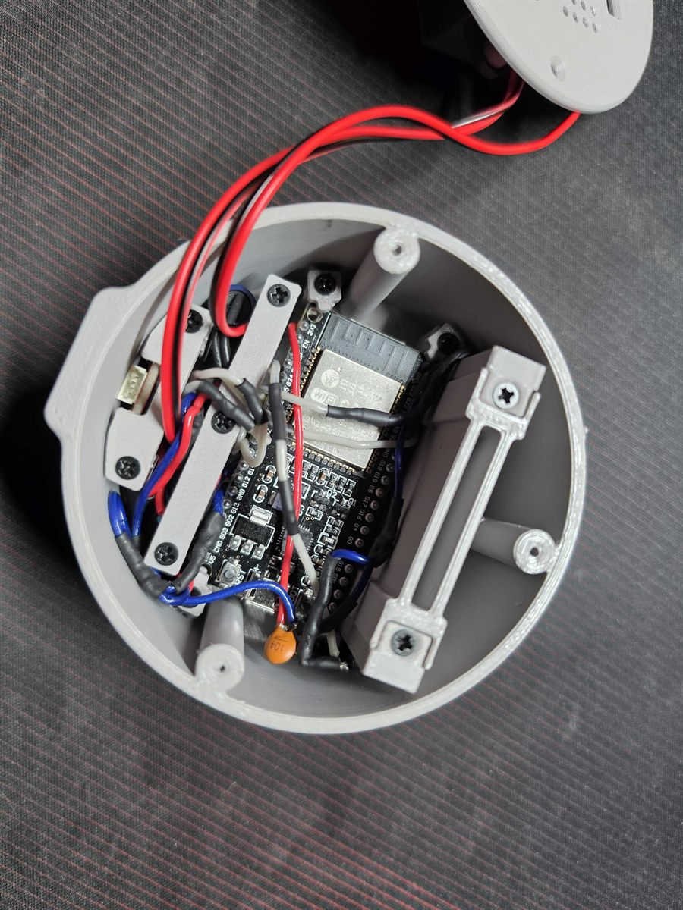

# coin-jar

Firmware for a coin jar with lights and sound, running on an ESP32. An infrared light barrier detects every coin dropped in, the RGB LEDs flash gold and two small speakers play a short chime. The firmware updates itself from GitHub Releases.

 

*The finished jar and the electronics in its top part.*

## Hardware

- ESP32 DevKit (`esp32dev`)
- 5x WS2811 5 mm RGB LED in a chain, 330 Ω resistor in the data line to the first LED
- IR light barrier: IR LED and a phototransistor read by the ADC (10 kΩ resistor on the phototransistor)
- 2x MAX98357 I2S amplifier with a small speaker each, one set to the left channel, one to the right

Wiring:

| Signal | GPIO |
|---|---|
| LED data (DIN of LED 1) | 33 |
| IR LED | 32 |
| Phototransistor (ADC) | 34 |
| I2S BCLK | 26 |
| I2S LRC (WS) | 25 |
| I2S DIN | 22 |

The LED pin and count are in [include/config.h](include/config.h). The light barrier and I2S pins are defaults in [include/CoinSensor.h](include/CoinSensor.h) and [include/Sound.h](include/Sound.h) and can be overridden with build flags.

The LEDs use the RGB color order (`NEO_RGB` in [src/Led.cpp](src/Led.cpp)). If red and green are swapped, change it to `NEO_GRB`.

## Behavior

On startup the LEDs pulse orange while the device connects to WiFi and checks for updates. Then the light barrier is calibrated and the jar waits for coins.

| Event | LEDs | Sound |
|---|---|---|
| WiFi connection and update check | pulsing orange | – |
| Light barrier does not work | 3 red blinks | – |
| Coin dropped in | gold while the chime plays | chime from both speakers (0.6 s) |

A coin is detected when the phototransistor value drops below 60 % of the idle value. The barrier is armed again once the value is back above 80 %. The idle value slowly follows changes of ambient light. The sensor is sampled about 2000 times per second.

Each coin is also logged to the serial monitor with the coin count, the measured value and the idle value.

## Light barrier calibration

At startup the firmware measures the phototransistor with the IR LED off and on and prints both values to the serial monitor. The difference should ideally be above 1000. Below 200 the barrier is reported as not working (3 red blinks) and a hint is printed:

| Hint | Meaning |
|---|---|
| almost zero | the phototransistor, or the IR LED, is probably reversed |
| saturated | too much light, replace the 10 kΩ resistor with 4.7 kΩ |
| small difference | check the polarity of the IR LED and the phototransistor |

## Sound

The chime is two mixed tones (1320 Hz and 1760 Hz) with a short fade-out, generated directly in the firmware. Volume is set in [src/main.cpp](src/main.cpp) with `Sound::setVolume()`, the range is 0 to 32767 and the default 2000 is quiet (1000 to 6000 is a sensible range). If the left and right speakers are swapped, set `SWAP_LR` in [src/Sound.cpp](src/Sound.cpp) to `true`.

## WiFi

Copy [include/secrets.example.h](include/secrets.example.h) to `include/secrets.h` (it is in `.gitignore`) and fill it in. Up to 4 networks are supported, remove the ones you don't need:

```cpp
#define SECRET_SSID "wifi-name"
#define SECRET_PASS "wifi-password"

#define SECRET_SSID_2 "second-wifi-name"
#define SECRET_PASS_2 "second-wifi-password"
```

The networks visible in a scan are tried first, in this order. On the first upload over USB all networks are saved to EEPROM. Firmware built by GitHub Actions has no `secrets.h` and uses the saved networks. To change them, edit `secrets.h` and upload the firmware over USB again.

## Build and upload

Requires [PlatformIO](https://platformio.org/) (CLI or the VS Code extension).

```
pio run -t upload
pio device monitor
```

The firmware prints its version, the result of the update check and the light barrier calibration to the serial monitor.

## Source layout

- `src/main.cpp` – `setup()` and `loop()`, reaction to a coin
- `src/Led.cpp` – WS2811 LEDs and the orange pulsing during startup
- `src/CoinSensor.cpp` – IR light barrier, calibration and coin detection
- `src/Sound.cpp` – I2S output and the chime
- `include/config.h` – LED pin, count, brightness and pulsing
- `include/WifiCredentials.h` – uses `secrets.h` if it exists

## Firmware update (OTA)

Uses the [esp-ota-updater](https://github.com/davidvancl/esp-ota-updater) library. On startup the device checks the latest release and updates itself if a newer version exists.

Releasing a new version:
1. Increase `custom_version` in `platformio.ini`.
2. Commit and push to `main`.
3. GitHub Actions publish a release. The device updates after its next restart.

Do not push a locally changed version in `platformio.ini` unless you want to publish a release.

## License

[MIT](LICENSE)
